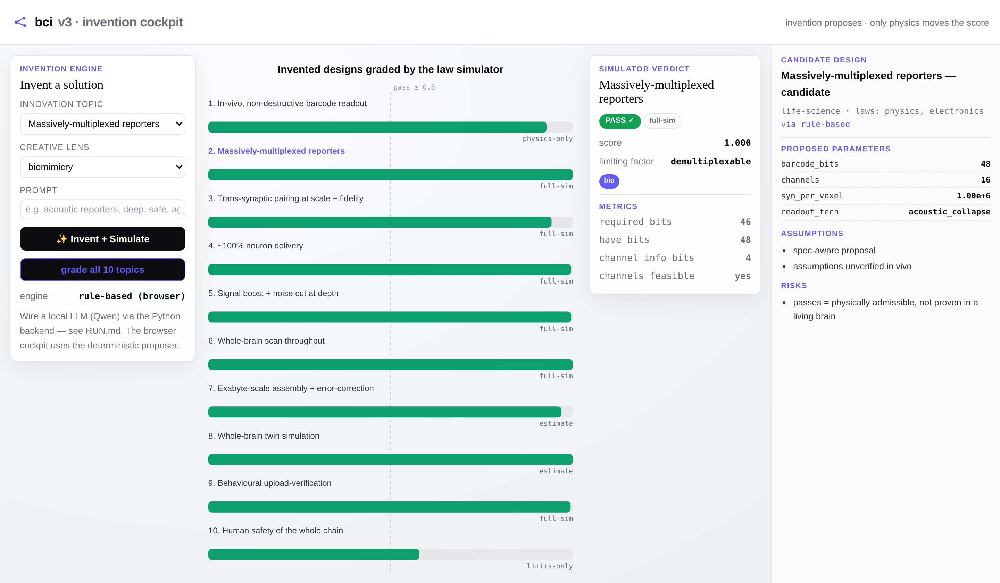
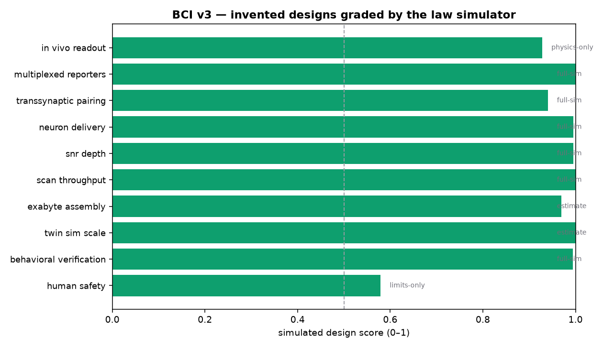
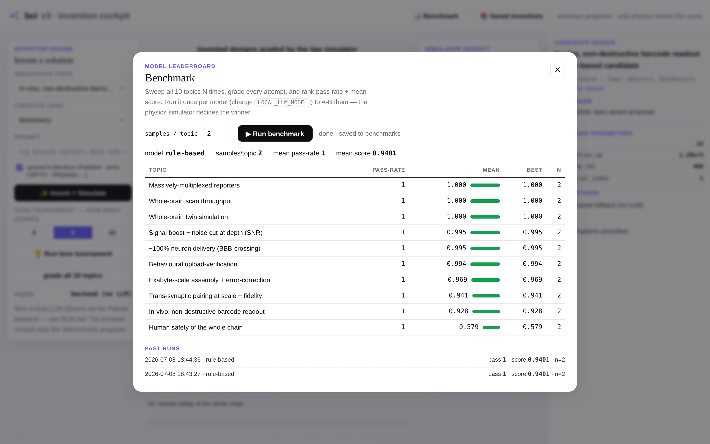
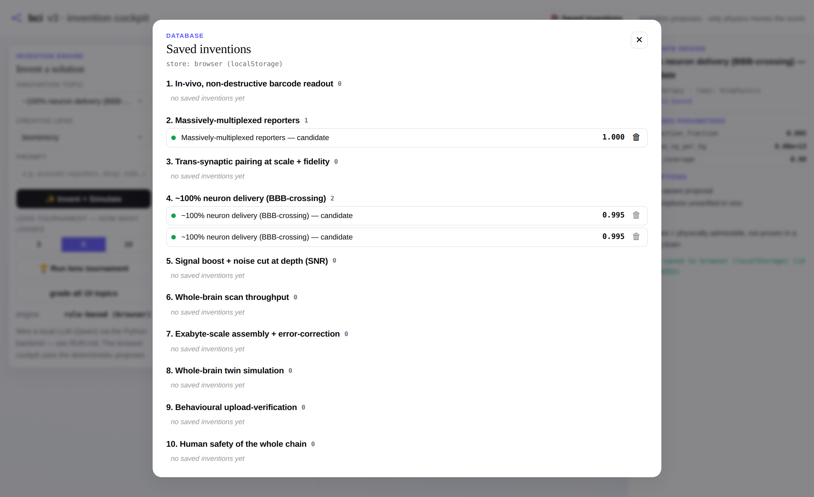

<div align="center">

# 🧪 Brain-Computer-Interface v3

### Invent past the 10 blockers — then let the laws of physics grade the invention.

**A local-LLM invention engine paired with a law-based simulator. Pick one of the 10 mapping
innovations, add a prompt, and the engine proposes a concrete design — which the simulator then
grades against the laws of biophysics, physics, and electronics. Invention proposes; only the
physics can move the score.**

[](LICENSE)
[](https://www.python.org/)
[](backend/tests)
[](#-the-10-innovation-topics)
[](#-the-invention-engine)
[](RUN.md)

_Author: **Dr. Sanjay Anbu**_

</div>

---

> ⚠️ **Private & proprietary.** Confidential work in progress. All rights reserved — not licensed
> for public use, reproduction, or redistribution.

---



> **The cockpit** (`docs/app/`) — v1's theme and floating-card cockpit view. Pick a topic + a
> creative lens + a prompt, hit **Invent + Simulate**, and the law simulator grades the design
> live: the verdict card (pass/fail + limiting number + metrics), the candidate design aside
> (proposed parameters + assumptions + risks), and the scorecard for all 10 topics.



> The same run as a static graph. Green = the proposed design is **physically admissible
> in-model**; the right-hand tag is the **fidelity** of that verdict (`full-sim` = fully modelled;
> `physics-only` / `estimate` / `limits-only` = honestly partial).

<table>
<tr>
<td width="50%"><br/><sub><b>📊 Benchmark</b> — sweep every topic × N samples; a pass-rate + mean-score leaderboard per category, with past-run history. Run it per model to A-B them.</sub></td>
<td width="50%"><br/><sub><b>📚 Saved inventions</b> — every invention auto-saved to MongoDB, grouped under the 10 innovation categories, each with a 🗑 delete.</sub></td>
</tr>
</table>

---

## 🎯 Project goals

- ✅ **Port the inventor-studio-v3 invention pipeline** — 10 creative lenses + critic/MVP reasoning, converted Node → Python.
- ✅ **Local-LLM-first** — runs on your **Qwen 7B** via `LOCAL_LLM_URL`, NVIDIA NIM fallback, rule-based fallback with no LLM at all.
- ✅ **All 10 innovation topics** from the v2 map, each with a target spec + parameter schema.
- ✅ **Law-based simulator** — biophysics · physics · electronics engines grade every design.
- ✅ **Invent → simulate → refine loop** — failures feed the limiting number back to the engine.
- ✅ **Candidate ranking** — one design per lens, ordered by simulated score (an idea tournament).
- ✅ **Honest fidelity flags** — a pass means *physically admissible*, never *proven in a living brain*.
- ✅ **29 tests, deterministic** — the whole pipeline runs offline in CI.
- ✅ **Cockpit GUI** — v1's theme + cockpit view; pick a topic, invent, and watch the law simulator grade it live in the browser.
- ✅ **Thin FastAPI backend** — the cockpit calls the Python engine (and your local Qwen) live; auto-detected, graceful browser fallback.
- ✅ **`.env` config** — paste `LOCAL_LLM_URL` / `LOCAL_LLM_MODEL` / `NVIDIA_API_KEY` once (zero-dependency loader, git-ignored).
- ✅ **Auto-save to a database** — every invention (design + multi-domain detail + parts + score) is captured in **MongoDB**, grouped by the 10 categories, with delete; JSONL fallback when Mongo is down.
- ✅ **Literature grounding** — searches **PubMed · arXiv · USPTO · PubChem · GitHub · SearXNG · Wikipedia** and invents from the retrieved prior art; citations are stored with the record.
- ✅ **Benchmark** — `bci bench` sweeps topics × N samples → pass-rate + mean-score leaderboard per category (A-B models), saved to the DB.
- ⬜ **Amber topics as full estimators** — richer models for assembly / twin-sim at scale (Phase 4).

---

## 🔭 What this is

v1 *interfaces* with a connectome. v2 *maps* it and measures the **10 blockers** that stand between
today and a non-invasive human brain map. **v3 tries to invent past those blockers** — and refuses
to take the invention's word for it:

```
 pick 1 of 10 topics  +  prompt
        │
        ▼
 RETRIEVAL   (PubMed · arXiv · USPTO · PubChem · GitHub · SearXNG · Wikipedia)
   → prior-art context to ground the design
        │
        ▼
 INVENTION ENGINE  (local Qwen, ported from inventor-studio-v3)
   → candidate design: mechanism + parameters + assumptions + risks + citations
        │
        ▼
 LAW SIMULATOR  — grades the parameters against:
   🧬 biophysics   (coverage, reporter kinetics, thermal/AAV safety limits)
   〰️ physics      (wave attenuation → SNR/depth, resolution wall, capacity law)
   🔌 electronics  (channels, bandwidth, scan-time, array feasibility)
        │
        ▼
 pass / fail  +  limiting number  →  auto-save to MongoDB (grouped by category)
```

The two halves are kept **separate on purpose**: a persuasive narrative can never fake a passing
score — only the physics moves the number.

---

## 🧩 The 10 innovation topics

| # | Topic | Layer | Domain | Laws | Fidelity |
|---|---|---|---|---|---|
| 1 | In-vivo, non-destructive barcode readout | 🧬 bio · 🔌 hw | life-science | physics, biophysics | physics-only |
| 2 | Massively-multiplexed reporters | 🧬 bio | life-science | physics, electronics | **full-sim** |
| 3 | Trans-synaptic pairing at scale | 🧬 bio | life-science | physics | **full-sim** |
| 4 | ~100% neuron delivery | 🧬 bio | cell-therapy | biophysics | **full-sim** |
| 5 | Signal boost + noise cut (SNR) | 🔌 hw · 🧬 bio | electronics | physics, biophysics | **full-sim** |
| 6 | Whole-brain scan throughput | 🔌 hw | hardware | electronics | **full-sim** |
| 7 | Exabyte assembly + error-correction | 💻 sw · 🧠 tpl | software | electronics | estimate |
| 8 | Whole-brain twin simulation | 💻 sw · 🌐 venv | software | electronics | estimate |
| 9 | Behavioural upload-verification | 🌐 venv | software | physics | **full-sim** |
| 10 | Human safety of the whole chain | 🧬 bio · 🔌 hw | cell-therapy | biophysics | limits-only |

**6 fully-modelled**, 4 honestly flagged. Domains map onto inventor-studio-v3's taxonomy
(software · hardware · electronics · life-science · cell-therapy · hybrid).

---

## 🧠 The invention engine

Ported from **inventor-studio-v3** — ten creative *lenses* frame the reasoning, then the model
must return a design whose **numeric parameters** the simulator can grade:

`analogical · inversion · crossDomain · extreme · historical · biomimicry · combinatorial ·
reduction · scaling · future`

`rank()` runs one candidate per lens and orders them by simulated score — a small idea tournament.

---

## ⚡ Quickstart

Requires **Python 3.10+** and **git**. (Optional: a local **Ollama + Qwen** for real invention,
and **MongoDB** for storage — both auto-detected, both have graceful fallbacks.)

### 1 · Get the code, then set up in **`backend/`**

**Windows (PowerShell)**
```powershell
# first time — clone:
git clone https://github.com/sanjaydoc/Brain-Computer-Interface-v3.git
cd Brain-Computer-Interface-v3
# already cloned — update instead:  cd Brain-Computer-Interface-v3 ; git pull origin main

cd backend                                        # ← setup runs here
Set-ExecutionPolicy -Scope CurrentUser -ExecutionPolicy RemoteSigned   # one-time, allows venv activate
python -m venv .venv                              # create the venv
.\.venv\Scripts\Activate.ps1                      # ACTIVATE (prompt shows (.venv))
pip install -e ".[dev,plot,api,db]"               # install dependencies
python -m pytest -q                               # verify → 29 passed
```

**macOS / Linux (bash / zsh)**
```bash
# first time — clone:
git clone https://github.com/sanjaydoc/Brain-Computer-Interface-v3.git
cd Brain-Computer-Interface-v3
# already cloned — update instead:  cd Brain-Computer-Interface-v3 && git pull origin main

cd backend                                        # ← setup runs here
python3 -m venv .venv                             # create the venv
source .venv/bin/activate                         # ACTIVATE (prompt shows (.venv))
pip install -e ".[dev,plot,api,db]"               # install dependencies
python -m pytest -q                               # verify → 29 passed
```

### 2 · Run the app — from the **repo root** (no `cd`, no activation)

```powershell
cd Brain-Computer-Interface-v3                   # ← the repo root
.\serve.ps1                                      # Windows  → http://localhost:8000/app/
```
```bash
cd Brain-Computer-Interface-v3                   # ← the repo root
./serve.sh                                       # macOS / Linux → http://localhost:8000/app/
```

The launchers find the venv for you (flags pass through: `.\serve.ps1 --port 9000`).

### 3 · The `bci` commands — **activate the venv once, then run from anywhere**

```powershell
# Windows — from the repo root:
.\backend\.venv\Scripts\Activate.ps1
```
```bash
# macOS / Linux — from the repo root:
source backend/.venv/bin/activate
```

With the venv active (your prompt shows `(.venv)`), these work from **any directory**:

```bash
bci serve                                       # API + cockpit on one port
bci health                                      # LLM provider / database / search sources
bci ping                                        # one tiny timed LLM call — is the model working & fast?
bci topics                                      # list the 10 innovation topics
bci invent multiplexed_reporters "deep, safe"   # invent + simulate, one-shot
bci record in_vivo_readout "non-destructive"    # search → invent → simulate → save to DB
bci record snr_depth "deep, safe" --no-ground   # skip the literature search (faster)
bci search "gas vesicle acoustic reporter"      # preview retrieved literature (per-source status)
bci bench --samples 5                           # leaderboard across all 10 topics
bci db --stats                                  # counts + pass-rate per category
```

> **First LLM run using `fallback` instead of your model?** Run **`bci ping`** — it fires one tiny
> timed call and prints the exact cause (wrong model, timeout, JSON-grammar hang, Ollama crash) with
> the one-line fix. See [RUN.md § 7 · Troubleshooting](RUN.md#7-troubleshooting).

### A-B two models (venv active, any directory)

Set `LOCAL_LLM_URL` + `LOCAL_LLM_MODEL` (best in `backend/.env`), then swap the model — the
physics simulator decides the winner:

```bash
# macOS / Linux
LOCAL_LLM_MODEL=qwen2.5:7b bci bench --samples 5
LOCAL_LLM_MODEL=qwen3.5:9b bci bench --samples 5
```
```powershell
# Windows (PowerShell)
$env:LOCAL_LLM_MODEL="qwen2.5:7b"; bci bench --samples 5
$env:LOCAL_LLM_MODEL="qwen3.5:9b"; bci bench --samples 5
```

### From Python (venv active)

```python
import bciv3
cand = bciv3.invent("multiplexed_reporters", "acoustic reporters, deep, safe")
print(bciv3.report("multiplexed_reporters", cand))      # design + verdict + limiting number
print(bciv3.bench.run(samples=3))                       # leaderboard across all 10 topics
```

**Full setup — MongoDB, `.env`, Ollama/Qwen, thinking models, per-OS details → [RUN.md](RUN.md).**

---

## 📁 Layout

```
backend/bciv3/
  llm.py               local-Qwen-first LLM adapter (→ NIM → cloud → rule-based fallback)
  laws/                the simulator: physics.py · biophysics.py · electronics.py
  innovations/         the 10 topics — base.py (abstraction) + catalog.py (specs + evaluators)
  engine/              invention pipeline: prompt.py (10 lenses) · inventor.py · loop.py
  simulator.py         route a candidate to its laws → Score
  detailer.py          multi-domain summary (biophysics/physics/electronics/biology) + parts
  recorder.py          invent → simulate → detail → save (one timestamped record)
  store.py             MongoDB persistence (+ JSONL fallback): save / list / grouped / delete
  cli.py               `bci` CLI: serve · ping · invent · record · bench · db · topics · search
  api/app.py           FastAPI: serves the cockpit + /api/{invent,record,inventions,rank,stats}
backend/tests/         29 deterministic tests
backend/scripts/       demo_invent.py
docs/app/              the cockpit GUI (v1 theme) — served by `bci serve`
```

---

## ⚖️ Honesty by construction

"Passes the simulator" means **physically admissible under the model** — that the design doesn't
violate a known law of biophysics, physics, or circuit feasibility. It does **not** mean *proven in
a living brain*. The fidelity flags (`physics-only`, `estimate`, `limits-only`) and the safety
topic's deliberately tight margin keep v3 a **research-agenda engine**, not a discovery oracle: it
prunes the impossible, ranks the plausible, and prints the target numbers to build toward.

---

<div align="center"><sub>Brain-Computer-Interface v3 · MIT License · Author: <b>Dr. Sanjay Anbu</b></sub></div>
